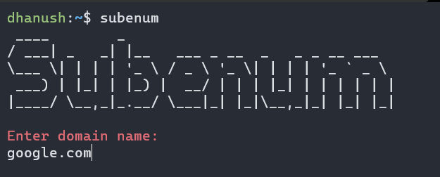

# subenum
Sub domain enumeration tool based on All open source Tool, this is a Bash file which performs Domain as target in all Described tools & resources and passes out the results and live domains into both seperate files.
<!--
*** Thanks for checking out the Best-README-Template. If you have a suggestion
*** that would make this better, please fork the repo and create a pull request
*** or simply open an issue with the tag "enhancement".
*** Thanks again! Now go create something AMAZING! :D
-->


<!-- PROJECT SHIELDS -->
<!--
*** I'm using markdown "reference style" links for readability.
*** Reference links are enclosed in brackets [ ] instead of parentheses ( ).
*** See the bottom of this document for the declaration of the reference variables
*** for contributors-url, forks-url, etc. This is an optional, concise syntax you may use.
*** https://www.markdownguide.org/basic-syntax/#reference-style-links
-->

[![LinkedIn][linkedin-shield]][linkedin-url] 


<!-- PROJECT LOGO -->
<br />
<p align="center">
  <a href="Logo.png">
    
  </a>
  </p>
</p>


<!-- ABOUT THE PROJECT -->
## About The Project
<br />
<p align="center">
  <a href="subenum_work.pngg">
    
  </a>
  </p>
</p>

There are many great scripts available on GitHub, however, I want to make myself an own script.

Here's why:
* Your time should be focused on creating something amazing. A project that solves a problem, helps others and understand's what's the code does in easy way.
* You shouldn't be doing the same tasks over and over like creating a folder or searching for if the same folder is existed or not.
* You should have clear path of discovering & gathering sub-domains. 
* Some of the tools fail's to discover the unique sub-domain's, So in the discovering phase while pen-testing or Bug Hunting, we should gather all the related stuff's to that organization.

Of course, no one tool/script will serve all the needs since your needs may be different. So I'll be adding more in the near future. You may also suggest changes by forking this repo and creating a pull request or opening an issue.

A list of commonly used resources that I find helpful are listed in the acknowledgements.

### Built With

This section should list any major frameworks that you built your project using. Leave any add-ons/plugins for the acknowledgements section. Here are a few examples.


### Prerequisites

This script runs in linux environment(linux & ubuntu tested)


### Installation

1. Clone the repo
   ```sh
   git clone https://github.com/dhanush1895/subenum.git
   ```
2. Install the script --> subenum-install.sh
   ```sh
   chmod +x subenum-install.sh
   ```
   ```sh
   ./subenum-install.sh
   ```
3. Enter your API-key's in `config.yaml`- subfinder config file,`config.ini`- amass config file.
4. Keep alias for subenum in your .profile/.bash_profile/.bash_aliases 
   ```sh
   alias subenum="bash path_to_script"
   ```


<!-- USAGE EXAMPLES -->
## Usage
1. ```sh
   subenum
   [LOGO]
   google.com
   ```

<!-- ROADMAP -->
## Roadmap
* To get massive amount of sub-domains using all the open-source tools
* To filter & resolve out the live sub-domains 
* To Run sub-domain takeover scan using nuclei templates

<!-- CONTRIBUTING -->
## Contributing

Contributions are what make the open source community such an amazing place to be learn, inspire, and create. Any contributions you make are **greatly appreciated**.


<!-- CONTACT -->
## Contact

Daniel goes by `dhanush1895` on Internet  - [@dhanush1895](https://twitter.com/dhanush1895) 

dhanushkalimeli@gmail.com


<!-- MARKDOWN LINKS & IMAGES -->
<!-- https://www.markdownguide.org/basic-syntax/#reference-style-links -->
[linkedin-shield]: https://img.shields.io/badge/-LinkedIn-black.svg?style=for-the-badge&logo=linkedin&colorB=555
[linkedin-url]: https://www.linkedin.com/in/daniel-thotapalli
[product-screenshot]: images/screenshot.png
